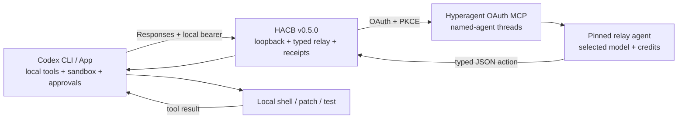

# I Put Hyperagent Behind Codex. Then I Made the Proof Harder to Fake.

The first version worked.

Codex sent a request to a local bridge. Hyperagent chose a shell tool. Codex ran that tool on my Mac. The result went back to Hyperagent, and the final answer returned to Codex. Hyperagent credits moved; my Codex subscription quota did not.

That was enough for a demo. It was not enough for a product.

The same test exposed oversized paid context, multiplied sampling calls, weak relay-model compliance, and receipts that proved routing without measuring latency. Worse, malformed tool decisions could degrade into plausible final text. The system could sound finished without doing the work.

So I stopped polishing the announcement and rebuilt the proof.

Disclosure: Hyperagent provided me with $5,000 in platform credits. They did not control this build or this write-up. The successful route, the credit-burn incident, and the unresolved platform gap are all part of the receipt.

## The model and the computer are different products

Codex is valuable because it is more than a text box. It reads repositories, calls a local shell, applies patches, runs tests, enforces a sandbox, and pauses for approval.

Hyperagent offered a different asset: named agents, multiple model choices, and a credit balance I already had.

I wanted to combine them without pretending they were the same layer:

```text
Codex CLI / App
  owns files, shell, patches, tests, sandbox and approvals
                     |
                     | Responses request + local bearer
                     v
127.0.0.1 Hyperagent Codex Bridge
  validates route, bounds context, translates tool actions
                     |
                     | OAuth + PKCE over documented MCP
                     v
Hyperagent named relay agent
  owns model selection, reasoning and credit usage
```

Hyperagent documents an OAuth MCP endpoint at `https://hyperagent.com/api/mcp`. Codex can use it directly, but named agents then appear as tools. They do not become the model behind Codex.

Hyperagent does not publicly expose the other interface Codex needs from a custom provider: a Responses-compatible inference endpoint.

The bridge fills that gap using only the supported MCP surface. No scraped browser session. No copied web token. No undocumented Hyperagent route.

## A picker label is not proof

Seeing `Custom` or `Hyperagent Credits` in Codex App only proves configuration.

The meaningful artifact is the complete local-tool loop:

```text
Codex request
-> Hyperagent reasoning thread
-> typed JSON function call
-> Codex executes the tool locally
-> tool result returns in the next request
-> Hyperagent final answer
-> correlated routing and latency receipt
```

The first public Mac proof completed that cycle with `pwd`. It established the architecture, but it ran on v0.4.0—the version that also revealed the cost problem.

## v0.4.0 worked too expensively

Codex App can inject large developer instructions, skills, environment details, and AGENTS content. The early bridge forwarded too much of it into paid Hyperagent runs.

Tool loops multiplied the effect. One user instruction requiring one tool is at least two sampling calls: one to select the tool and another to interpret its result. Longer tasks fan out further. v0.4.0 had no persistent local daily ceiling.

The resulting credit consumption was unacceptable. I do not have a clean enough public ledger to give you a defensible dollar-per-turn figure, so I will not invent one.

The supportable lesson is stronger than a dramatic number: a working route can still be an unsafe product if cost scales at a hidden protocol boundary.

v0.4.1 responded with six requests per UTC day, low effort, stripped injected context, eight retained turns, 24,000 retained characters, 6,000 characters per turn, 32 forwarded tools, a 70,000-character prompt ceiling, and blocked multi-agent delegation.

Those rails were necessary. They did not solve proof quality.

## The dangerous v0.4.1 failure was semantic

The relay agent has an odd job. It does not touch the computer. It must read Codex's forwarded tool definitions and return exactly one JSON action.

Smaller models often struggled with that translation role. They wrapped JSON in prose, invented tool names, used the wrong argument fields, or said they could not access local files instead of asking Codex to do it.

The v0.4.1 bridge tried to be forgiving. That was the mistake.

If the relay returned plain text or requested a missing tool, the parser could turn the response into final assistant text. A malformed action became a fluent answer. Codex might look done even though no shell, patch, or test ran.

v0.5.0 fails closed instead.

It extracts a single balanced JSON object, validates the action type, requires an exact forwarded tool name, parses function arguments, checks a useful subset of the tool's JSON Schema, and rejects missing required fields or forbidden extras. Invalid JSON, invented tools, unsupported actions, malformed custom-tool input, and empty tool-search queries receive typed error codes.

The public receipt records the error code, not the relay's raw output.

This does not make a weak model stronger. It makes weakness visible.

## The first command now proves something without spending anything

The biggest first-run improvement is:

```bash
hacb demo
```

That command launches the real Codex binary against a temporary loopback bridge and deterministic local relay. The relay asks Codex to run a shell command. Codex runs it locally. The marker returns in the next sampling request. The relay finishes.

It exercises the real Responses provider, Codex tool discovery, local execution, SSE translation, tool-result continuation, and final answer. It uses no Hyperagent OAuth and no Hyperagent credits.

On the release-candidate machine, Codex 0.144.6 completed the demo in 574 milliseconds wall time with two sampling requests and the expected `function_call -> final` sequence.

That is not a live Hyperagent proof. It is something equally important before one: evidence that the local half of the product works before money enters the loop.

The paid proof is explicit:

```bash
hacb demo --live --confirm-spend
```

It refuses to run without confirmation or at least two requests of daily budget headroom. After Codex completes, it requires correlated receipts containing both a function call and a final answer.

On the day I cut the candidate, doctor found the authorized machine at 10/10 requests and blocked the proof. After explicit approval, I raised the ceiling temporarily to 12, ran exactly one controlled tool loop, restored the original ceiling, and stopped the bridge.

The live route completed in 27.1 seconds wall time. The first Hyperagent request returned a typed `function_call` in 13.8 seconds. Codex executed the shell command locally. The second request returned the final action in 11.8 seconds. Two requests completed, none failed, and the receipt correlates both bridge request IDs with their Hyperagent thread IDs without storing the prompt or answer.

## Doctor became a security and routing audit

`hacb doctor` now checks:

- Node and Codex versions;
- an exact `127.0.0.1` bridge host;
- the documented Hyperagent MCP URL;
- OAuth issuer binding;
- the three intended scopes: `threads:read`, `threads:write`, and `offline_access`;
- presence of the independent local bearer;
- private state-directory permissions;
- remaining daily budget;
- OAuth connectivity;
- reachable named agents;
- stale pinned routes;
- authenticated loopback bridge health;
- a generated Codex Responses profile.

`hacb doctor --json` makes those checks usable by automation without printing secrets.

Model routing is also less surprising. New installations expose pinned aliases by default. `hacb models --all` deliberately discovers candidates; `hacb alias` pins a public model slug to an exact named-agent ID. Unknown model slugs fail instead of falling through to a default agent.

Clean routing is not a cosmetic feature when different agents can use different models, instructions, and budgets.

## Receipts now measure what the bridge can actually know

Every v0.5.0 sampling request gets a correlation ID. Audit events record:

- bridge version and transport;
- selected model and agent;
- request and sanitized-prompt character counts;
- forwarded tool count;
- daily budget position;
- thread-creation latency;
- thread-wait latency;
- parse latency;
- total latency;
- output type or redacted failure code.

`hacb receipt` turns those events into a public JSON or Markdown summary with completion counts and p50/p95 latency. Thread IDs are hashed by default and can be included only deliberately.

Prompts, answers, OAuth tokens, refresh tokens, the local bearer, and Codex authentication never enter the receipt.

One field is deliberately unsatisfying:

```text
costMeasurement: unavailable_from_supported_mcp
```

The documented Hyperagent MCP thread result does not provide per-request usage or cost. The bridge can count requests and measure latency. Exact billing still requires an operator to compare the Hyperagent credit view before and after a controlled run.

Calling that a “cost receipt” would be dishonest. It is a routing and latency receipt with an explicit cost-data boundary.

## Security is two credentials and one narrow boundary

The bridge authenticates to Hyperagent using OAuth authorization code + PKCE. It validates state, binds discovery to the expected issuer/origin, rotates refresh tokens, and asks only for thread read/write plus offline access.

Codex authenticates separately to the local bridge with a random machine-local bearer. That credential is not a Hyperagent token. The server binds to `127.0.0.1`; model and Responses routes require the bearer; state and generated configuration receive restrictive local permissions where supported.

The release verifier rejects private-state filenames, common key patterns, and undocumented `hyperagent.com/api/*` routes. It checks version equality, whitespace errors, the full test suite, and the real Codex binary when installed.

The v0.5.0 suite is 27/27 with real Codex tests enabled. CI is defined across Linux, macOS, and Windows on Node 20 and 22, with a separate macOS job for Codex 0.144.6.

That is source parity, not a claim that I captured a physical Windows Codex App proof. I did not.

## Why the bridge is still slow and lossy

This architecture pays an adapter tax.

Every Codex sampling call becomes a separate Hyperagent thread. The bridge serializes bounded context, creates the thread, polls it, waits for completion, parses one relay action, and translates it back into Responses events.

Hyperagent MCP does not stream model-token deltas through this path. The bridge sends SSE keepalives so Codex does not time out, but useful output arrives after the Hyperagent thread completes.

The relay protocol also compresses rich client state into bounded JSON. Context stripping is essential for cost and privacy, but stripped context cannot inform reasoning. Images remain text-first. Desktop may show `Custom`. A model still has to perform exact protocol translation before it can ask for a local tool.

v0.5.0 makes those failures measurable and deterministic. It does not remove them.

This remains a bounded proof of concept, not production inference infrastructure.

## Rollback remains part of the product

CLI mode uses a separate Codex profile. App Mode changes the main config only after making a protected backup.

Return new App chats to normal Codex defaults before stopping the bridge:

```bash
hacb app-off
hacb stop
hacb uninstall-profile
hacb logout
```

Then revoke OAuth access in Hyperagent settings if the machine is being removed. Each new machine receives a new OAuth grant; token-bearing state is never copied.

## The platform ask

The best future version of this bridge is no bridge.

Hyperagent should expose a documented endpoint shaped like:

```text
POST /v1/responses
Authorization: Bearer <OAuth access token>
Accept: text/event-stream
```

It should accept a named agent or model ID, standard Responses input, client-tool definitions, and continuation state. It should stream standard SSE response, text, and tool events. It should return stable trace IDs and machine-readable usage/cost metadata while preserving OAuth PKCE, issuer binding, least-privilege scopes, revocation, and Hyperagent credit attribution.

That endpoint removes thread-per-sample emulation, polling, the JSON relay prompt, fake streaming, and manual billing proof. Codex and other clients keep their local harness; Hyperagent becomes a first-class reasoning provider.

The bridge now proves enough to make the request concrete.

The first release proved packets could move.

The second proved a route without brakes is dangerous.

The third proves the harder thing: where trust lives, how failure should look, and exactly which native API would make the workaround disappear.

The model is replaceable. The receipt is the product.

---

## Evidence table

| Claim | Evidence | Status |
| --- | --- | --- |
| 27 tests pass with Codex 0.144.6 | `docs/V0.5.0_PROOF.md`, test source, release verifier | Proven locally |
| Real Codex local-tool loop works without credits | `hacb demo` receipt | Proven |
| Strict relay actions fail closed | protocol and bridge regression tests | Proven |
| Supported OAuth boundary is preserved | OAuth/MCP source and verifier | Proven |
| v0.5.0 live Hyperagent loop | `docs/V0.5.0_LIVE_DEMO_RECEIPT.md` | Proven: two requests, local function call, final |
| Per-request latency | correlated v0.5.0 audits | Measured |
| Per-request Hyperagent cost | supported MCP result | Not available |
| Windows source parity | CI matrix | Implemented; CI run pending publication |
| Physical Windows App UI | screenshot | Pending |

## Architecture diagram source



## Visual brief

Hero: dark 16:9 system diagram with Codex/local tools in blue, the loopback bridge in amber, and Hyperagent in purple. Show a bright function-call arrow returning to a local terminal, then a tool-result arrow returning to Hyperagent. Add three proof badges: `27/27`, `real Codex`, and `fail closed`.

Second graphic: a before/after split. v0.4.1 on the left turns malformed relay prose into a misleading final answer. v0.5.0 on the right produces `relay_invalid_json` and a redacted receipt. Caption: “Fluent is not the same as executed.”

Third graphic: one user turn expanding into two or more paid sampling threads, with `costMeasurement: unavailable_from_supported_mcp` highlighted. End the flow at the requested native `/v1/responses` + OAuth + SSE endpoint.

Never show real tokens, prompts, answers, private paths, raw private thread IDs, or undocumented endpoints.
